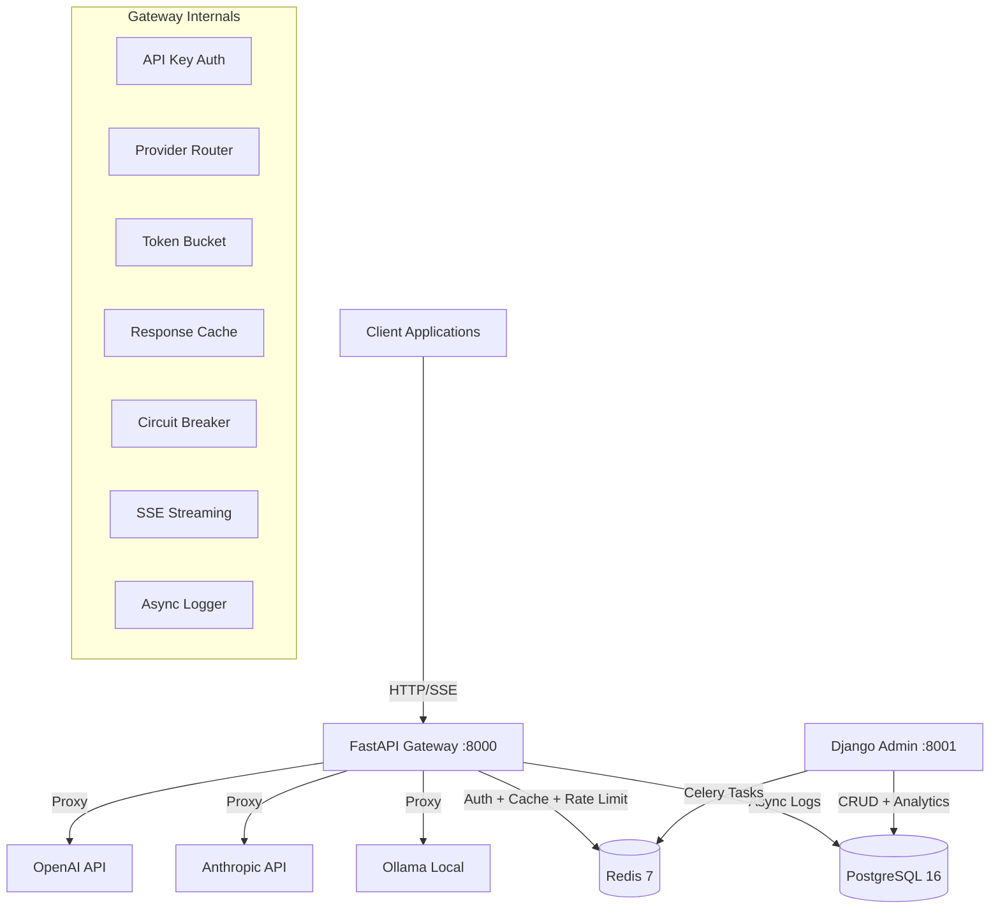

# AI-Powered API Gateway

A production-grade API gateway that sits between client applications and multiple LLM providers (OpenAI, Anthropic, Ollama), providing unified authentication, multi-provider routing, token-bucket rate limiting, response caching, usage analytics, circuit breaker resilience, and SSE streaming pass-through.

## Architecture



## Quick Start

### 1. Clone and configure

```bash
git clone <your-repo-url>
cd ai-api-gateway
```

### 2. Start all services

```bash
docker compose up --build -d
```

This starts:

- **FastAPI Gateway** → http://localhost:8000 (API docs at `/docs`)
- **Django Admin** → http://localhost:8001 (admin panel at `/admin/`)
- **PostgreSQL 16** → localhost:5432
- **Redis 7** → localhost:6379

### 3. Seed providers and create an API key

```bash
# Seed default providers (OpenAI, Anthropic, Ollama)
docker compose exec admin python /scripts/seed_providers.py

# Generate an API key
docker compose exec admin python /scripts/generate_key.py --name "My App"
```

### 4. Test the gateway

```bash
# Health check
curl http://localhost:8000/health

# List available models
curl http://localhost:8000/v1/models

# Chat completion (requires valid API key + provider key)
curl -X POST http://localhost:8000/v1/chat/completions \
  -H "Authorization: Bearer sk-your-key-here" \
  -H "Content-Type: application/json" \
  -d '{
    "model": "gpt-4",
    "messages": [{"role": "user", "content": "Hello!"}]
  }'
```

## Key Features

| Feature              | Description                                                        |
| -------------------- | ------------------------------------------------------------------ |
| **Multi-Provider**   | Route requests to OpenAI, Anthropic, or Ollama based on model name |
| **API Key Auth**     | SHA-256 hashed keys with Redis-cached lookups                      |
| **Rate Limiting**    | Token bucket with Lua atomicity, per-key and daily limits          |
| **Response Caching** | Redis cache for deterministic requests (temp=0)                    |
| **Circuit Breaker**  | 3-state per-provider with automatic failover                       |
| **SSE Streaming**    | Full pass-through with incremental token counting                  |
| **Analytics**        | Async logging with cost tracking per model                         |
| **Admin Portal**     | Django-based key management and usage dashboards                   |

## Project Structure

```
ai-api-gateway/
├── docker-compose.yml          # All 4 services
├── .env.example                # Environment variables template
├── gateway/                    # FastAPI service (hot path)
│   ├── main.py                 # App factory + lifespan
│   ├── config.py               # Pydantic Settings
│   ├── dependencies.py         # DI (DB, Redis, auth)
│   ├── auth/                   # API key validation
│   ├── routing/                # Provider routing + endpoints
│   ├── providers/              # OpenAI, Anthropic, Ollama
│   ├── ratelimit/              # Token bucket + middleware
│   ├── cache/                  # Redis response cache
│   ├── resilience/             # Circuit breaker + retry
│   ├── streaming/              # SSE pass-through
│   ├── logging_/               # Async request logger
│   ├── schemas/                # Pydantic request/response models
│   └── tests/                  # Unit + integration tests
├── admin_portal/               # Django service (control plane)
│   ├── keys/                   # API key management
│   ├── analytics/              # Usage analytics + Celery tasks
│   └── billing/                # Cost tracking
└── scripts/                    # CLI utilities
```

## API Endpoints

### Gateway (FastAPI)

| Method | Path                   | Description                         |
| ------ | ---------------------- | ----------------------------------- |
| GET    | `/health`              | Gateway health check                |
| GET    | `/v1/models`           | List available models               |
| POST   | `/v1/chat/completions` | Chat completion (OpenAI-compatible) |
| GET    | `/docs`                | OpenAPI documentation               |

### Admin Portal (Django)

| Method         | Path                      | Description           |
| -------------- | ------------------------- | --------------------- |
| GET/POST       | `/api/keys/`              | List/create API keys  |
| GET/PUT/DELETE | `/api/keys/<id>/`         | Manage a specific key |
| GET/POST       | `/api/keys/providers/`    | List/create providers |
| GET            | `/api/analytics/logs/`    | Query request logs    |
| GET            | `/api/analytics/summary/` | Usage summary         |
| GET            | `/api/billing/`           | Billing records       |
| GET            | `/api/billing/summary/`   | Billing summary       |

## Tech Stack

- **Python 3.11+** with full type annotations
- **FastAPI** (async gateway) + **Django 5.x** (admin portal)
- **SQLAlchemy 2.0** (async) for the gateway, **Django ORM** for admin
- **PostgreSQL 16** (shared database)
- **Redis 7** (cache, rate limiter, circuit breaker, Celery broker)
- **Docker Compose** for local development
- **structlog** for structured JSON logging
